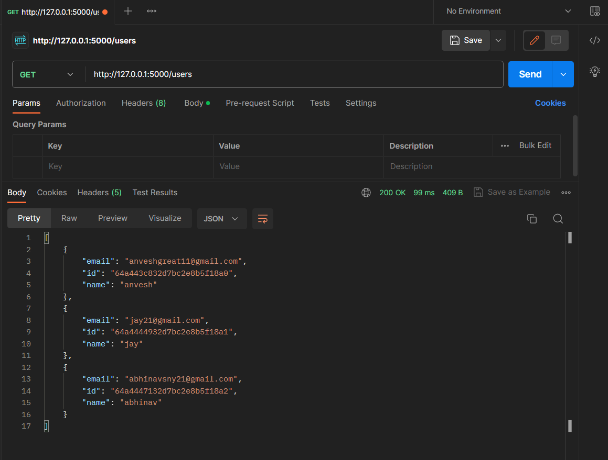
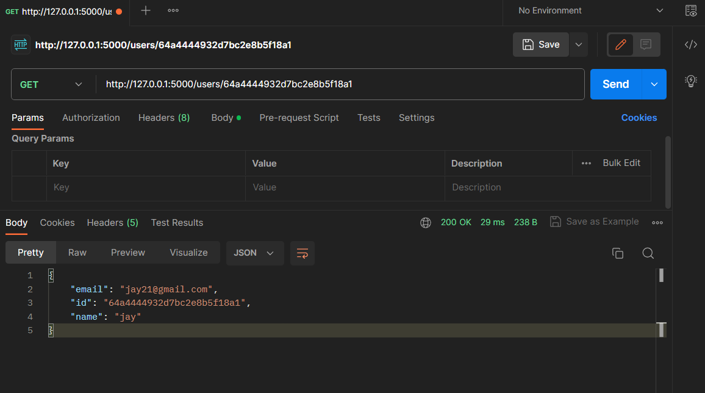
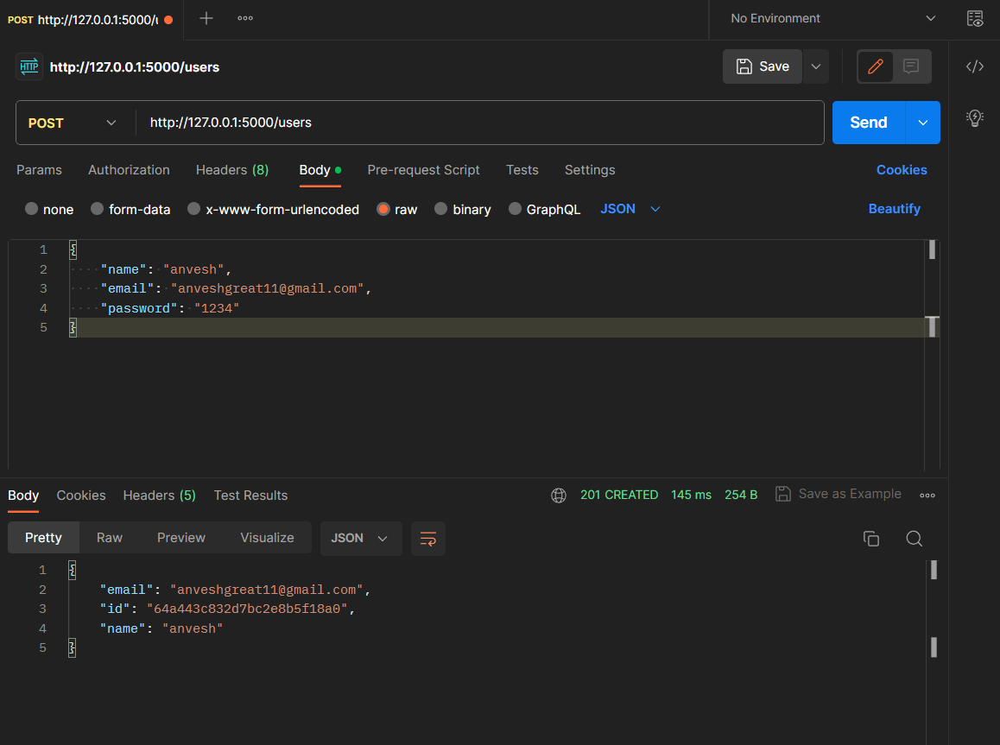
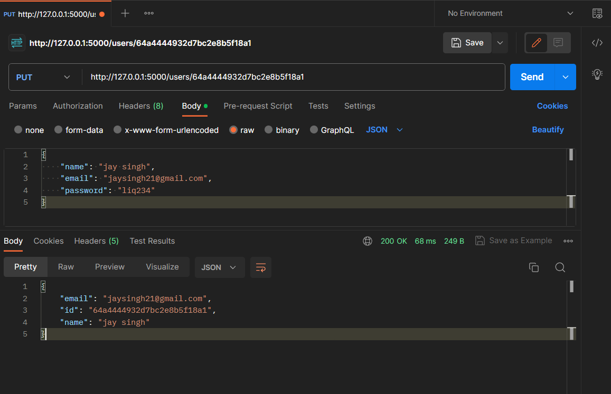

# Corider User API
A Flask user resource API.
## Setting up the API:

### Without docker:
- Create a virtual environment in the project directory and activate it.
```py
> py -m venv venv
> ./venv/Scripts/activate
```

- Install dependencies.
```py
> pip install requirements.txt
```
- Run the application.
```py
flask run
```

### With docker:
- Run the following commands in your project directory.
```py
> docker build -t corider-api .
```
```
> docker run -d -p 5000:5000 corider-api corider-api
```

- Now the application will start running on `localhost:5000`

### API testing
- Use Postman to test the API
- Following endpoints can be called
```
GET localhost:5000/users
GET localhost:5000/users/<user_id>
POST localhost:5000/users
PUT localhost:5000/users/<user_id>
DELETE localhost:5000/users/<user_id>
```

## Postman Preview:

### GET


### GET by user id

### POST


### PUT


### DELETE
